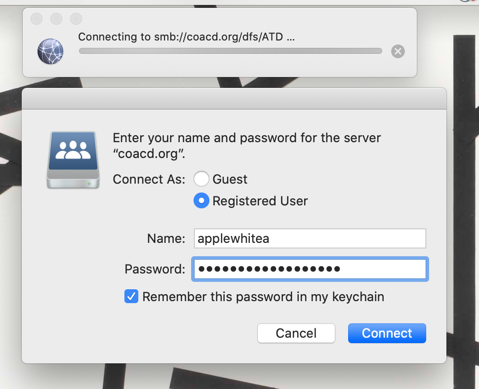

# Document Storage 🗄️

## Collaborative Docum​ents

To prevent the proliferation of different versions of multi-editor documents, all collaborative documents are stored on the cloud:

* [Document templates](https://drive.google.com/open?id=1Txqc8xGkwa3h9lrRoXGzGjLlVo0S8DA6)
* ​[DTS Google Drive](https://drive.google.com/drive/folders/1fNmU-czryk5wJsn1gmb4WYUJJdut8Me7)​ - [​account setup](https://github.com/cityofaustin/atd-data-tech/wiki/Using-Google-as-a-City-employee)​​
* [DTS Sharepoint/Teams drive](https://teams.microsoft.com/_#/tab::7dc26d1f-21aa-43dd-9dd9-ab25188b15a7/General?threadId=19:6125816a2bd34142a9b23fc916a968b8%40thread.skype&ctx=channel)

## Windows-only File Types

GIS files, Visio documents, and other files that can only be used on a Windows operating system are stored on the [ATD departmental network G drive](https://coacd.org/dfs/ATD).

## Sensitive Information

Sensitive information should be stored on the H Drive. Private employee information such as personnel-related files 

## Everything Else

Other documents can be stored either in the cloud or on the [ATD departmental network G drive](https://coacd.org/dfs/ATD), whichever is most practical for the team and customer.


Be aware that anything stored on your local drive — the Windows C drive or Mac HD — is not backed up or accessible via other devices.  


## **How to Connect to Network Drives on a Mac**

_You will need to be either hard-connected to the City network or_ [_connected via VPN_](https://atd-dts.gitbook.io/wiki/on-boarding#vpn-and-remote-access)_._ From Finder on Mac: _Go &gt; Connect to Server_ then type the address in the _Server Address_ field

* H Drive: 
* G Drive: `smb://coacd.org/dfs/ATD`

