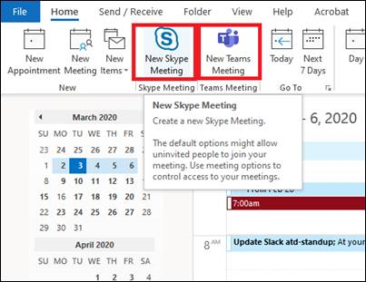

# Working Remotely

## Teleworking

#### Pre-requisites

* Filled out Telework forms \(should be approved your supervisor\) 
* Completed the CTM Cybersecurity Class

#### Software available: 

_**Citrix**:_ is used to remote into a work computer using your personal computer. 

_**NetMotion**&gt;**Remote Desktop Connection:**_ If you have a city used laptop, it most likely has NetMotion installed. This laptop should be taken home/alternative work site.

_**Cisco AnyConnect:**_ is a virutal private network \(VPN\) which is generally used for contractors _\(this is a more extensive process to get this set-up\)_

### How to install Citrix Receiver 

Download and install the Citrix Workspace – Keep all defaults. NOTE!! – **Do NOT configure anything in the workspace, it just has to be running, which will be setup by default.**

If this is your ATD provided pc, call ATD IT Support to install. 

_NOTE: Chrome may not work. You must use Firefox or IE._

a.     Windows [https://www.citrix.com/downloads/workspace-app/](https://www.citrix.com/downloads/workspace-app/)

b.     Mac - [https://www.citrix.com/downloads/workspace-app/](https://www.citrix.com/downloads/workspace-app/)

You should now see a Citrix Icon in the Notification area – bottom, right side of screen.

### How to connect via Citrix from outside COA Network

From **Outside** the COACD Network \(from home pc\) 

Use this link: **https:\\coacitrix.austintexas.gov**  
Login with your network username and password

Click “**Detect Receiver**” and tell it to open the Workspace.

_NOTE: If you DO NOT have the workspace or have trouble using it, you can use the **light version** which is a web plugin._

If you don't see any apps, look to the left and click the "plus sign" 

Select the apps you would like to use by clicking on them. This action will place the icon on the desktop. 

Go back to the home screen

Click on the desired icon, "Remote Desktop Connection". The Citrix receiver will run and open up the app. 

### How to connect via Citrix from inside COA Network

From **Inside** the COACD network _\(you are on someone else’s pc at work and need to remote into yours\)_: [https://coastore.austintexas.gov](https://coastore.austintexas.gov) . Works the same as External site except the login page looks like this:

## Phone Forwarding

* [Instructions on how to request phone forwarding in Service Portal link](https://atx.service-now.com/sp?id=kb_article&sys_id=14a79820dbbfb3005b03f482ba961972)
  * Need to log into the ServiceNow portal to access knowledge base article
* [Instructions on how to setup and use phone forwarding](https://atx.service-now.com/sp?id=kb_article&sys_id=c918d420dbbfb3005b03f482ba9619fc)
  * Can use phone E500 button
  * Can call to enable forwarding to your phone
  * Can call to disable forwarding to your phone

## Online Meetings

According to Scott, most if not all of you should already have Skype on your computer.

First thing is first, check if your computer has it already installed. Click on the start button on the bottom left of your screen and begin typing “Skype”. You may see Skype, but we want to make sure “Skype for Business” is installed as well.

**Step 1: Search if Skype is already installed**  
Microsoft Skype

**Step 2: Log in**  
You will want to enter in your work email, it may also take you to the city’s log in page where you’ll need to enter your email address and network \(computer password\).

If you didn’t know, you can create a meeting that has remote access to Ms Skype or Ms Teams.

**Step 3: \(Optional\)** Open Outlook and go to the calendar tab and you’ll see on the menu bar these options. It will add a remote meeting link to your meeting invite and a phone number for users to call. You can choose to call in using the phone line or using your computer to be on the call \(headphones may be required\). When using laptops some can allow you talk through your computer’s microphone.

_NOTE: Skype for Business is being retired by Microsoft. CTM staff have ceased use of Skype in their Department, they are solely using MS Teams. A lot of other departments are also slowly transitioning from Skype to Teams._  
 [Read more information here](https://docs.microsoft.com/en-us/microsoftteams/faq-journey)

Another alternative is Microsoft Teams \(MS Teams\). I think some of you are using this application already. This has the same functionality as Skype allowing you to chat/connect remotely to a meeting and screen share.

**Step 1: Search if Teams is already installed**  
 Microsoft Teams

 **Step 2: It will have a similar log in page to Skype.** _\(You’ll need your city email and network password.\)_

